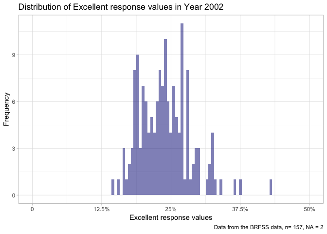
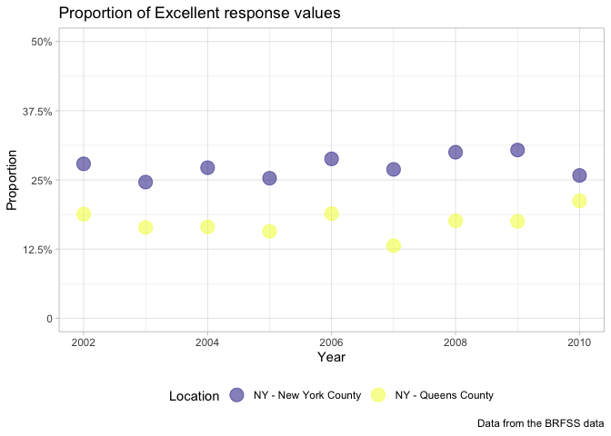

p8105\_hw2\_cz2544
================
Chunxiao Zhai
9/29/2018

Problem 1
---------

1.1 Read and clean the data: retain line, station, name, station latitude / longitude, routes served, entry, vending, entrance type, and ADA compliance. Convert the entry variable from character (YES vs NO) to a logical variable (the ifelse or recode function may be useful).

``` r
library(tidyverse)
transit_data = 
  read_csv(file = "./NYC_Transit_Subway_Entrance_And_Exit_Data.csv") %>% 
  janitor::clean_names() %>% 
  select(line, starts_with("station"), starts_with("route"), entry, vending, entrance_type, ada) %>%
  mutate(entry = recode(entry, "YES" = TRUE, "NO" = FALSE)) 
```

1.2 Write a short paragraph about this dataset: explain briefly what variables the dataset contains, describe your data cleaning steps so far, and give the dimension (rows x columns) of the resulting dataset. Are these data tidy?

The dataset contains 20 variables. Namely "line", "station\_name", "station\_latitude", "station\_longitude", "station\_location", "route1", "route2", "route3", "route4", "route5", "route6", "route7", "route8", "route9", "route10", "route11", "entry", "vending", "entrance\_type", "ada".

So far, I have cleaned the variable names and select the required rows to the leftside, and converted the entry variable from character (YES vs NO) to a logical variable, resulted in a dataset with dimention of 1868 \* 20.

I do not think the data is tidy. Because the routes1 to 10 is not a real variable. The real varialble would be whether a train passed a staition, not ranking all the trains horizontally.

1.3 Answer the following questions using these data: How many distinct stations are there? Note that stations are identified both by name and by line (e.g. 125th St A/B/C/D; 125st 1; 125st 4/5); the distinct function may be useful here. How many stations are ADA compliant? What proportion of station entrances/exits without vending allow entrance?

``` r
distinct_data = distinct(transit_data, line, station_name, ada)
sum(distinct_data$ada)
```

    ## [1] 84

``` r
no_vding_data = filter(transit_data, vending == "NO")
sum(no_vding_data$entry)/nrow(no_vding_data)
```

    ## [1] 0.3770492

There are 465 distinct stations, among them 84 are ADA compliant, the proportion of station entrances/exits without vending allow entrance is 0.3770492.

1.4 Reformat: Reformat data so that route number and route name are distinct variables. How many distinct stations serve the A train? Of the stations that serve the A train, how many are ADA compliant?

``` r
transit_tidy_data = 
  gather(transit_data, key = route_number, value = route_name, route1:route11 )
```

``` r
a_train_data = 
  filter(transit_tidy_data, route_name == "A") %>% 
  distinct(line, station_name, ada)

nrow(a_train_data)
```

    ## [1] 60

``` r
sum(a_train_data$ada)
```

    ## [1] 17

There are 60 distinct stations serve the A train. Among them 17 are ADA compliant.

Problem 2
---------

2.1 Read and clean the Mr. Trash Wheel sheet: Specify the sheet in the Excel file and to omit columns containing notes (using the range argument and cell\_cols() function) Use reasonable variable names Omit rows that do not include dumpster-specific data rounds the number of sports balls to the nearest integer and converts the result to an integer variable (using as.integer)

``` r
library(readxl)
tw_data = 
  read_excel("./HealthyHarborWaterWheelTotals2017-9-26.xlsx", range = cell_cols(1:14)) %>% 
  janitor::clean_names() %>% 
  filter(!is.na(dumpster)) %>% 
  mutate(sports_balls = as.integer(round(sports_balls)))
```

2.2 Read and clean precipitation data for 2016 and 2017: For each, omit rows without precipitation data and add a variable year. Next, combine datasets and convert month to a character variable (the variable month.name is built into R and should be useful).

``` r
library(readxl)
preci_2016 = 
  read_excel("./HealthyHarborWaterWheelTotals2017-9-26.xlsx", sheet = 4, range = "A2:B14") %>% 
  janitor::clean_names() %>% 
  mutate(year = 2016)
preci_2017 =
  read_excel("./HealthyHarborWaterWheelTotals2017-9-26.xlsx", sheet = 3, range = "A2:B14") %>% 
  janitor::clean_names() %>% 
  mutate(year = 2017)

preci_tidy = 
  bind_rows(preci_2016, preci_2017) %>% 
  janitor::clean_names() %>% 
  mutate(month = month.name[month])
```

2.3 Write a paragraph about these data Be sure to note the number of observations in both resulting datasets, and give examples of key variables. For available data, what was the total precipitation in 2017? What was the median number of sports balls in a dumpster in 2016?

``` r
balls_2016 = filter(tw_data, year == 2016)
```

There are 12 observations in the preci\_2016 dataset, and 12 observations in the preci\_2017 dataset, 216 observations in the Mr. Trash Wheel dataset. Key variables are month, total, year in precipitation data, and dumpster, month, year, date, weight\_tons, volume\_cubic\_yards, plastic\_bottles, polystyrene, cigarette\_butts, glass\_bottles, grocery\_bags, chip\_bags, sports\_balls, homes\_powered in the Mr. Trash Wheel dataset. The total precipitation in 2017 was 29.93, the median number of sports balls in a dumpster in 2016 is 26.

Problem 3
---------

3.1 Format the data to use appropriate variable names; Focus on the “Overall Health” topic Exclude variables for class, topic, question, sample size, and everything from lower confidence limit to GeoLocation. Structure data so that values for `Response` ("Excellent" to "Poor") are column names / variables which indicate the proportion of subjects with each response (which are values of `Data_value` in the original dataset) Create a new variable showing the proportion of responses that were “Excellent” or “Very Good”

``` r
devtools::install_github("p8105/p8105.datasets")
library(p8105.datasets)
```

``` r
library(tidyverse)
brfss_tidy =
  janitor::clean_names(brfss_smart2010) %>% 
  filter(topic == "Overall Health") %>% 
  select(-class, -topic, -question, -sample_size, -(confidence_limit_low:geo_location)) %>% 
  spread(key = response, value = data_value) %>% 
  janitor::clean_names() %>% 
  mutate(prop_better = excellent + very_good )
```

3.2 How many unique locations are included in the dataset? Is every state represented? What state is observed the most? In 2002, what is the median of the “Excellent” response value?

``` r
getmode = function(v) {
   uniqv = unique(v)
   uniqv[which.max(tabulate(match(v, uniqv)))]
}
getmode(brfss_tidy$locationabbr)
```

``` r
exlt_2002 = 
  filter(brfss_tidy, year == 2002)
```

There are 404 unique locations included in the dataset. All 51 states were represented, NJ is the state observed most. In 2002, the median of the “Excellent” response value is 23.6.

Make a histogram of “Excellent” response values in the year 2002.

``` r
excellent_plot_1 = ggplot(exlt_2002, aes(excellent)) +
  geom_histogram( fill = "navy", alpha = .5, binwidth = 0.5, bins = 70) +
  labs(
    title = "Distribution of Excellent response values in Year 2002",
    x = "Excellent response values",
    y = "Frequency",
    caption = "Data from the BRFSS data, n= 157, NA = 2"
  ) +
  scale_x_continuous(breaks = c(0, 12.5, 25, 37.5, 50),
                     labels = c("0", "12.5%", "25%", "37.5%", "50%"),
                     limits = c(0, 50)) +
  theme_light()

ggsave("excellent_plot_1.pdf", excellent_plot_1)
```

    ## Saving 7 x 5 in image

    ## Warning: Removed 2 rows containing non-finite values (stat_bin).

``` r
excellent_plot_1
```

    ## Warning: Removed 2 rows containing non-finite values (stat_bin).



Make a scatterplot showing the proportion of “Excellent” response values in New York County and Queens County (both in NY State) in each year from 2002 to 2010.

``` r
exlt_prop = 
  filter(brfss_tidy, locationdesc == "NY - New York County" | locationdesc == "NY - Queens County")

excellent_plot_2 = 
  ggplot(exlt_prop, aes(x = year, y = excellent, color = locationdesc)) +
  geom_point(size = 5,alpha = .5) +
  labs(
    title = "Proportion of Excellent response values",
    x = "Year",
    y = "Proportion",
    caption = "Data from the BRFSS data") + 
  scale_y_continuous(
    breaks = c(0, 12.5, 25, 37.5, 50),
    labels = c("0", "12.5%", "25%", "37.5%", "50%"),
    limits = c(0, 50)) +
  viridis::scale_color_viridis(
    option = "plasma",
    name = "Location", 
    discrete = TRUE) + 
  theme_light() + 
  theme(legend.position = "bottom")

ggsave("excellent_plot_2.pdf", excellent_plot_2)
```

    ## Saving 7 x 5 in image

``` r
excellent_plot_2
```



R Markdown
----------

This is an R Markdown document. Markdown is a simple formatting syntax for authoring HTML, PDF, and MS Word documents. For more details on using R Markdown see <http://rmarkdown.rstudio.com>.

When you click the **Knit** button a document will be generated that includes both content as well as the output of any embedded R code chunks within the document. You can embed an R code chunk like this:

``` r
summary(cars)
```

    ##      speed           dist       
    ##  Min.   : 4.0   Min.   :  2.00  
    ##  1st Qu.:12.0   1st Qu.: 26.00  
    ##  Median :15.0   Median : 36.00  
    ##  Mean   :15.4   Mean   : 42.98  
    ##  3rd Qu.:19.0   3rd Qu.: 56.00  
    ##  Max.   :25.0   Max.   :120.00

Including Plots
---------------

You can also embed plots, for example:


Note that the `echo = FALSE` parameter was added to the code chunk to prevent printing of the R code that generated the plot.
